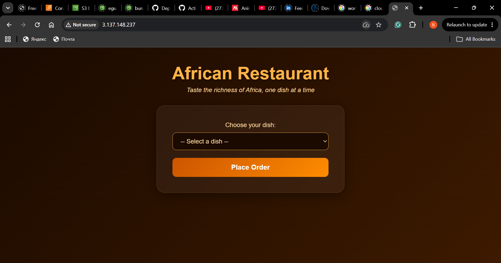
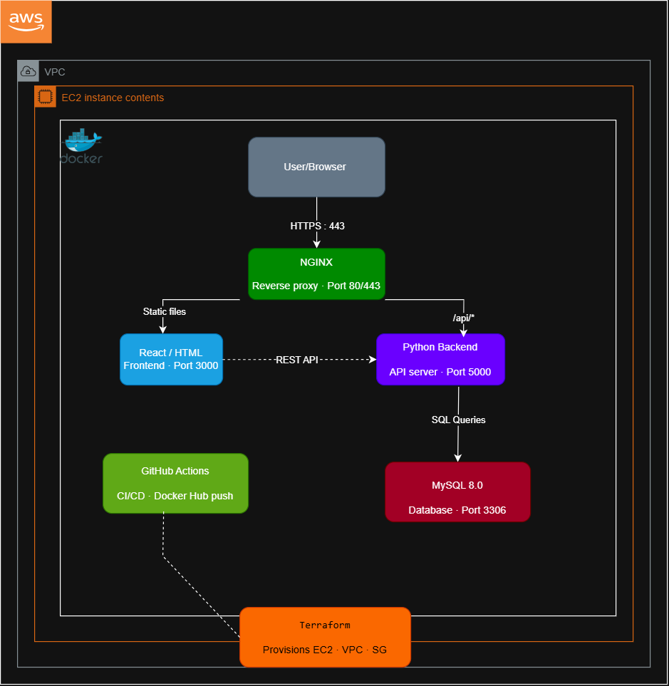

# 🍽️ Restaurant App — DevOps Project

## Overview
A containerized 3-tier restaurant ordering application built with Python Flask, MySQL 8.0, and Nginx. The infrastructure is provisioned on AWS using Terraform, configured with Ansible, containerized with Docker Compose, and automated with a GitHub Actions CI/CD pipeline that builds and pushes Docker images to Docker Hub on every push to main.

## Screenshot


## Architecture Diagram


## Tech Stack
| Layer | Technology |
|-------|-----------|
| Frontend | Nginx (HTML, CSS) |
| Backend | Python Flask — Port 5000 |
| Database | MySQL 8.0 — Port 3306 |
| Reverse Proxy | Nginx — Port 80/443 |
| Containerization | Docker & Docker Compose |
| Infrastructure | AWS EC2 (t3.micro · Amazon Linux 2) |
| Provisioning | Terraform |
| Configuration | Ansible |
| CI/CD | GitHub Actions → Docker Hub |

---

## Step-by-Step Deployment Guide

### Step 1 — Clone the Repository
Start by pulling the project files from GitHub onto your local machine:
```bash
git clone https://github.com/bemsimbomrandy93-netizen/restaurant-app.git
cd restaurant-app
```

### Step 2 — Provision AWS Infrastructure with Terraform
Terraform creates the EC2 instance, VPC, subnet, internet gateway, and security groups on AWS automatically.
```bash
cd terraform
terraform init
terraform plan
terraform apply
```
After terraform apply completes, it will output the public IP address of your EC2 instance. Copy that IP address — you will need it in the next steps.

### Step 3 — SSH Into the EC2 Instance
Once the EC2 instance is running, connect to it using your key pair:
```bash
ssh -i grace-batch.pem ec2-user@YOUR-EC2-IP
```
This gives you terminal access to the server where the app will run.

### Step 4 — Configure the Server with Ansible
Ansible automatically installs Docker, Docker Compose, and starts the application on the EC2 instance. Run this from your local machine:
```bash
cd ansible
ansible-playbook -i YOUR-EC2-IP, playbook.yml --private-key grace-batch.pem -u ec2-user
```
Ansible will update the server packages, install Docker and Docker Compose, copy the project files to the server, and start the application with Docker Compose.

### Step 5 — Access the Application
Once Ansible finishes, open your browser and visit:
http://YOUR-EC2-IP
The restaurant ordering app is now live and accessible to anyone on the internet.

### Step 6 — CI/CD Pipeline (GitHub Actions)
The project includes an automated CI/CD pipeline that runs every time code is pushed to the main branch.

| Step | What Happens |
|------|-------------|
| 1 | Developer pushes code to GitHub |
| 2 | GitHub Actions lints the Python code with flake8 |
| 3 | GitHub Actions builds the Docker image |
| 4 | GitHub Actions pushes to Docker Hub at justrandy1030/restaurant-app:latest |

Required GitHub Secrets:
| Secret | Value |
|--------|-------|
| DOCKER_USERNAME | Your Docker Hub username |
| DOCKER_PASSWORD | Your Docker Hub access token |

---

## Author
Bemsimbom Randy — DevOps Engineer
GitHub: https://github.com/bemsimbomrandy93-netizen
Docker Hub: https://hub.docker.com/u/justrandy1030
